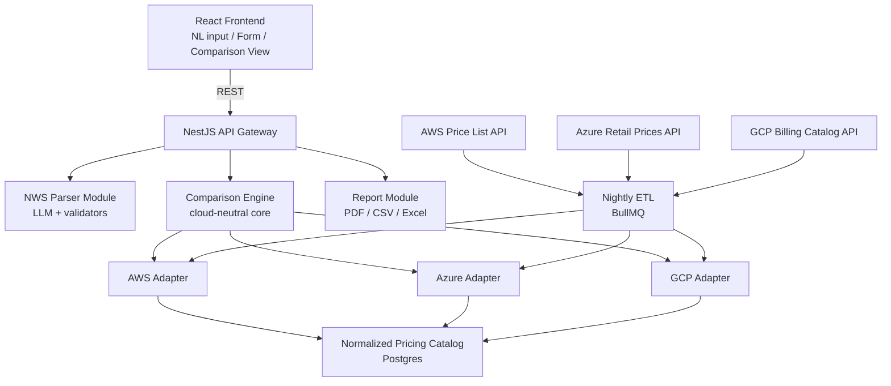

# PolyCost - Architecture (V1 / MVP)

## High-level system diagram



## Core modules

### 1. NWS Parser Module

Responsibility: convert any input format into a valid Normalized Workload
Specification (NWS).

- `NLParserService`: sends user free text to an LLM with a strict structured-output
  prompt and JSON schema enforcement, then returns a draft NWS.
- `FormToNWSService`: deterministically maps structured form fields to NWS without
  making an LLM call.
- `NWSValidator`: shared validation layer that both paths run through before the NWS
  is considered valid and handed downstream. This is the only place NWS validation
  logic lives.

Design rule: `NLParserService` and `FormToNWSService` produce the exact same NWS
shape. Nothing downstream knows or cares which path produced it.

### 2. Comparison Engine

Responsibility: given a valid NWS, orchestrate calls to all registered cloud adapters
and assemble the comparison result.

- `ComparisonOrchestratorService`: takes NWS, fans out to every registered
  `CloudProviderAdapter`, collects results, and assembles `ComparisonResult`.
- `IntervalCostCalculator`: pure function that derives daily, weekly, monthly,
  quarterly, and yearly costs from a base monthly cost. This is the only place
  interval math happens.
- `EquivalentServiceMapper`: uses the curated mapping table seed dataset to map NWS
  workload tiers to provider-specific service and SKU choices.

The engine must never import from `/adapters/aws`, `/adapters/azure`, or
`/adapters/gcp` directly. It only depends on the `CloudProviderAdapter` interface.

### 3. Cloud Provider Adapters

Responsibility: translate between the cloud-neutral core and provider-specific pricing
data or APIs.

Each adapter implements:

```typescript
interface CloudProviderAdapter {
  readonly providerId: string; // 'aws' | 'azure' | 'gcp'

  priceWorkload(nws: NormalizedWorkloadSpec): Promise<ProviderPricingResult>;

  refreshPricingCatalog(): Promise<void>;

  refreshLivePricing(serviceIds: string[]): Promise<void>;
}
```

Adding a fourth provider in a future version means writing one new class implementing
this interface and registering it, without changing the Comparison Engine.

### 4. Pricing ETL Module

Responsibility: keep the normalized pricing catalog fresh.

- Scheduled BullMQ job runs nightly on a configurable schedule.
- Each adapter's `refreshPricingCatalog()` is invoked independently.
- One provider API being down or slow does not block the others.
- Job results are logged and surfaced through a simple admin/status endpoint.
- Failures and partial refreshes must not be silently swallowed.

### 5. Report Module

Responsibility: turn a `ComparisonResult` into PDF, CSV, and Excel.

- `PdfReportGenerator`, `CsvReportGenerator`, and `ExcelReportGenerator` each take
  the same `ComparisonResult` shape as input.
- Report generation never re-runs pricing logic.
- Generated reports are deterministic for the same `ComparisonResult`, modulo
  timestamps, so report behavior remains testable.

## Data flow

1. User submits natural language text or fills the structured form.
2. Frontend calls `POST /api/workload/parse`.
3. NWS Parser Module returns a draft NWS.
4. Frontend shows the editable structured form.
5. User confirms or edits the form.
6. Frontend calls `POST /api/comparisons`.
7. Comparison Engine validates NWS and fans out to all three adapters.
8. Each adapter queries the cached pricing catalog by default.
9. Comparison Engine assembles `ComparisonResult` and computes all five time
   intervals.
10. Frontend renders the three-column comparison view.
11. User optionally calls `GET /api/comparisons/:id/export?format=pdf|csv|xlsx`.

## Adapter-pattern rationale

The adapter pattern directly serves the roadmap. V2's draw.io parser, V3's Terraform
generator, and V4's Terraform parser are additional input or output modules, not
changes to the Comparison Engine or provider adapters.

As long as a module produces or consumes valid NWS and `ComparisonResult` objects, it
plugs into the same core. Do not special-case input sources inside comparison or
adapter layers.

## Frontend architecture notes

- Build the comparison view as a reusable component from day one.
- V2 diagram-cost overlays and V4 Terraform-import comparisons should reuse the same
  comparison component with different entry points above it.
- Form state for the editable NWS should have a single source of truth, such as a React
  context or store, because both the natural-language path and direct-form path feed
  into it.
