# 🔎 Production Readiness Audit

**Date:** 2026-08-28 · **Scope:** whole repository · **Method:** evidence-based
probes against the running system, database, CI history and build output. Every
finding below was reproduced, not inferred.

---

## 📊 Verdict

| Dimension            |        Grade        | Note                                                         |
| -------------------- | :-----------------: | ------------------------------------------------------------ |
| 🔐 Security          |    🟢 **Strong**    | Phase-0 blockers closed; SSRF, IDOR, WORM, tenancy addressed |
| 💰 Correctness       |    🟢 **Strong**    | Money, currency, concurrency, UTC, accuracy harness          |
| 💾 Data durability   |    🟢 **Strong**    | Atomic writes, guarded retention, atomic migrations          |
| 🧪 Test depth        |     🟢 **Good**     | 541 API + 170 web, order-independent                         |
| 🚦 **CI / release**  |   🔴 **Blocked**    | Red for the entire session; 2 gates still failing            |
| 👁️ **Observability** |    🔴 **Absent**    | No metrics, no tracing, no structured logs                   |
| ♻️ **Lifecycle**     |  🔴 **Defective**   | Shutdown hooks never enabled — cleanup never runs            |
| 📈 Horizontal scale  |  🟠 **Not ready**   | In-memory rate limiter; no orchestration manifests           |
| 📦 Supply chain      | 🟠 **Failing gate** | 7 high advisories (dev tree)                                 |
| 🐳 Container posture |     🟠 **Weak**     | Runs as root, no HEALTHCHECK                                 |

**Bottom line:** the _application logic_ is in good shape — genuinely
production-grade in correctness and security. What is missing is the
**operational layer**: you cannot currently observe it, deploy it safely, or
scale it horizontally. Those are the gaps between "works" and "runnable in
production".

---

## 🔴 P0 — Blocks release

### P0-1 · CI has been red continuously

**Evidence:** every run on `main` failed. Two distinct causes:

| Cause                                         | Introduced     | Status              |
| --------------------------------------------- | -------------- | ------------------- |
| `Format check` — 11+ unformatted files        | pre-existing   | ✅ **fixed**        |
| `npm ci` lockfile desync (`@nestjs/common`)   | PR #153 (mine) | ✅ **fixed** (#164) |
| `Spec and workflow QA` — direct `process.env` | pre-existing   | 🔴 **open**         |
| `Dependency security scan` — 7 highs          | pre-existing   | 🔴 **open**         |

After the two fixes CI now clears `npm ci`, format, lint and hex guard, then
stops at **QA**. Because CI failed at `npm ci` in ~15s from #153 onward, **none
of the 16 quality steps ran on 12 merges**. Local verification is why nothing
actually broke — but that is luck plus discipline, not a gate.

### P0-2 · `qa` gate fails — direct `process.env`

`apps/api/src/adapters/common/http-client.ts` reads `PROVIDER_HTTP_*` directly.
**Fix:** add the keys to the zod config schema and inject them.
`parseJsonResponse` already accepts `{ maxBytes, bodyTimeoutMs }`, so only the
production path remains. **~2–4 h.**

### P0-3 · `npm audit` — 7 high advisories

All in the **development/tooling** tree (`@sentropic/graphify` →
`officeparser` → `pdfjs-dist`; plus `brace-expansion`, `fast-uri`,
`ip-address`, `js-yaml`). Not runtime, but the gate is red. **~4 h.**

---

## 🟠 P1 — Unsafe in production

### P1-1 · ♻️ Graceful shutdown is never enabled — **highest-risk finding**

**Evidence:** 6 classes implement `onModuleDestroy` (DB pool, BullMQ queue and
worker, …) but `apps/api/src/main.ts` never calls `app.enableShutdownHooks()`.
Nest disables them **by default**.

**Consequence:** on every deploy, restart or scale-down (SIGTERM):

- the Postgres pool is not closed cleanly;
- **BullMQ workers are not drained** — in-flight jobs can be lost or
  re-delivered and double-processed;
- in-flight HTTP requests are cut off.

This is the classic "works in dev, corrupts in prod" failure — the cleanup code
was written, it simply never runs.

**Fix:** `app.enableShutdownHooks()` + a Fastify close timeout. **~1 h**, plus a
test asserting hooks fire.

### P1-2 · 🚦 Rate limiter is in-memory — breaks under scale

**Evidence:** `ApiRateLimitService` stores buckets in `new Map()`. It guards
**auth**, comparisons, diagram parsing, cost-management and refresh-live.

**Consequence:** with _N_ instances the effective limit is _N×_. That weakens
brute-force protection on auth and the control on **paid provider API calls**
(the SEC-5 hardening). Buckets also reset on every restart.

**Fix:** back it with Redis — already a dependency. **~1 day.**

### P1-3 · 🐳 Containers run as root, no HEALTHCHECK

No `USER` directive in either Dockerfile; no `HEALTHCHECK`. Health _endpoints_
exist and are good (`/health/live`, `/health/ready` with dependency latency) —
they are simply not wired into the container or an orchestrator.
**Fix:** non-root user + `HEALTHCHECK`. **~2 h.**

---

## 🔴 P2 — Observability is absent

| Capability                |   Status    | Impact                                                     |
| ------------------------- | :---------: | ---------------------------------------------------------- |
| 📈 Metrics (Prometheus)   |    **0**    | No RED/USE signals; cannot alert on error rate or latency  |
| 🔗 Distributed tracing    |    **0**    | Cannot see where a slow comparison spends its time         |
| 📝 Structured logging     |    **0**    | Nest default `Logger` in 6 files; not JSON, not correlated |
| 🚨 Error tracking         | **0** (API) | Exceptions visible only in container logs                  |
| 🆔 Request correlation ID |    **0**    | Cannot follow one request across components                |

**This is the single largest systemic gap.** Every other subsystem is
instrumented for _correctness_ (pricing traces, audit trails, data-health) but
the _runtime_ is dark. In production you would not know the API was degraded
until a user reported it.

**Fix:** structured JSON logger + correlation IDs (~1 day) → `/metrics` with
RED metrics (~1 day) → OpenTelemetry tracing (~2 days) → dashboards and alerts
(~2 days).

---

## 🟡 P3 — Operability & scale

| #    | Gap                            | Evidence                                                            | Effort |
| ---- | ------------------------------ | ------------------------------------------------------------------- | ------ |
| P3-1 | No orchestration manifests     | 0 k8s / Helm / infra Terraform; only `docker-compose` (single host) | ~1 wk  |
| P3-2 | No load or performance testing | no k6 / artillery / load-test assets                                | ~3 d   |
| P3-3 | No OpenAPI specification       | 0 Swagger usage; contracts are prose + tests                        | ~2 d   |
| P3-4 | No circuit breakers            | retry exists in 7 files; no breaker                                 | ~2 d   |
| P3-5 | `pre-push` hook impractical    | runs `check:full` (needs Docker/e2e); gets bypassed                 | ~1 h   |
| P3-6 | CI is one serial job           | ~16 steps, no matrix/sharding; slow feedback                        | ~1 d   |
| P3-7 | Suites contend in parallel     | 5 s timeout under CPU contention                                    | ~1 h   |

> ℹ️ **Backup/DR is documented** (`docs/DEPLOYMENT.md` — managed Postgres, PITR)
> but there is no restore _drill_ or automated verification. Documented ≠ tested.

---

## 🔵 P4 — Maintainability

| #    | Item                         | Detail                                                                   |
| ---- | ---------------------------- | ------------------------------------------------------------------------ |
| P4-1 | `App.tsx` still 14,540 lines | Down from 21,227 (−31%); ~215 pure functions remain                      |
| P4-2 | Doc drift                    | Corrected one stale claim; a periodic accuracy sweep is worth scheduling |

---

## ✅ Genuine strengths — do not regress these

- **Provenance everywhere.** Every price carries source, SKU, derivation and
  hash. Rare and genuinely valuable.
- **Destructive actions are opt-in.** Retention and artifact deletion default to
  `report-only`.
- **Transactional integrity.** Audit event + outbox commit atomically; retention
  refuses to prune an event with an undelivered export.
- **Health endpoints are real** — dependency checks with latency, not a 200 stub.
- **Static gates beyond tests** — hex guard, `qa` conventions, format, spec
  checks. These caught real defects the test suite missed.
- **Provider-quirk correctness** — Azure block meters, GCP SUD, spot exclusion.

---

## 🗺️ Roadmap to production

```mermaid
gantt
    title Production readiness
    dateFormat X
    axisFormat %s
    section 🔴 Sprint 1 — unblock
    Fix qa gate (P0-2)            :0, 1
    Resolve advisories (P0-3)     :0, 1
    Graceful shutdown (P1-1)      :0, 1
    Container hardening (P1-3)    :0, 1
    section 🟠 Sprint 2 — safe to scale
    Redis rate limiter (P1-2)     :1, 2
    Structured logs + trace IDs   :1, 2
    Metrics endpoint              :1, 2
    section 🟡 Sprint 3 — observable
    OpenTelemetry tracing         :2, 3
    Dashboards and alerts         :2, 3
    Error tracking                :2, 3
    section 🔵 Sprint 4 — operable
    K8s/Helm manifests            :3, 4
    Load testing + budgets        :3, 4
    Restore drill                 :3, 4
```

### Sprint 1 · Unblock release ⏱️ ~1 week

**Goal: CI green, deploys safe.**

1. **P1-1 graceful shutdown** — _do this first_; highest risk, ~1 h.
2. **P0-2** `qa` gate — config schema for `PROVIDER_HTTP_*`.
3. **P0-3** dependency advisories.
4. **P1-3** non-root container + `HEALTHCHECK`.
5. **P3-5** slim `pre-push` to fast static gates.

✅ **Exit:** CI green end-to-end; a deploy drains cleanly.

### Sprint 2 · Safe to scale ⏱️ ~1 week

1. **P1-2** Redis-backed rate limiter (**required before running >1 instance**).
2. Structured JSON logging + request correlation IDs.
3. `/metrics` with RED metrics.

✅ **Exit:** two instances can run behind a load balancer without weakening
rate limits.

### Sprint 3 · Observable ⏱️ ~1–2 weeks

OpenTelemetry tracing across API → adapters → DB · dashboards · alerting on
error rate, latency, queue depth, ETL freshness · error tracking.

✅ **Exit:** you learn about degradation from an alert, not a user.

### Sprint 4 · Operable at scale ⏱️ ~2 weeks

K8s/Helm manifests with probes wired to the existing health endpoints ·
load testing with performance budgets · **restore drill** · OpenAPI spec ·
circuit breakers.

✅ **Exit:** reproducible deploys, known capacity, proven recovery.

---

## 🎯 If you only do three things

1. **Enable shutdown hooks** (~1 h) — silent job loss/duplication on every deploy.
2. **Move the rate limiter to Redis** (~1 d) — a security control that silently
   weakens the moment you scale out.
3. **Add structured logging + metrics** (~2 d) — you cannot operate what you
   cannot see.

🔬 Findings reproduced against the running system, live database, CI history
and production build output on 2026-08-28.
