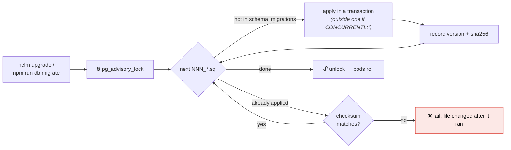

# Database Migrations

PolyCost's schema lives in `database/migrations/NNN_name.sql`, applied in version
order by one migrator: [`docker/postgres/migrate.sh`](../docker/postgres/migrate.sh).
The same script runs in every environment, so they cannot disagree:

| Where                           | How it runs                                                          |
| ------------------------------- | -------------------------------------------------------------------- |
| Fresh compose volume            | the Postgres init hook (`docker/postgres/initdb.d`)                  |
| Existing compose database       | `npm run db:migrate`                                                 |
| Kubernetes (Helm)               | the `pre-install` / `pre-upgrade` Job, image built from `Dockerfile` |
| Anywhere else (ECS, a VM, a CI) | run the migrations image as a one-off task with libpq env vars       |



## What the migrator guarantees

- **Ordering:** every `NNN_*.sql`, in version order. Files are discovered, never listed by hand.
- **One runner:** a Postgres session advisory lock. A second runner, such as a retried Job or a
  manual `db:migrate`, waits and then finds nothing to do.
- **Atomic files:** each file runs in a transaction. A file containing
  `CONCURRENTLY`, or the marker `-- migrate:no-transaction`, runs outside one,
  because Postgres requires that.
- **Integrity:** the migrator records a sha256 for every applied file in
  `schema_migrations.checksum`. If an applied file is edited later, the next run
  fails. Rows from before checksums existed adopt the current file as their baseline.
- **Fail closed in Kubernetes:** a failed Job fails the Helm release, and the running pods
  keep serving the old schema.

## Running it

```bash
npm run db:migrate                     # local compose database
MIGRATE_DRY_RUN=1 npm run db:migrate   # list pending migrations, apply nothing
npm run db:validate                    # file rules (below) + live database is current
```

The migrations image takes standard libpq variables:

```bash
docker build -f database/Dockerfile -t polycost-migrations .
docker run --rm \
  -e PGHOST=db.internal -e PGDATABASE=polycost -e PGSSLMODE=verify-full \
  -e PGUSER=polycost_owner -e PGPASSWORD=… \
  -e APP_DB_PASSWORD=… -e ETL_DB_PASSWORD=… \
  polycost-migrations
```

`APP_DB_PASSWORD` and `ETL_DB_PASSWORD` (or `*_FILE` paths) are only needed when
`002_least_privilege_roles.sql` has to create the `polycost_app` and `polycost_etl`
roles. They must match the credentials stored in Vault under `polycost/db`.
Roles that already exist are left alone, and the migration works with any
database name.

## Writing a migration

`npm run db:validate` enforces these rules, and CI runs it:

1. **Name** it `NNN_lower_snake_case.sql`, using the next number. No gaps and no duplicates.
2. **Start** with `\set ON_ERROR_STOP on`.
3. **End** with
   `INSERT INTO schema_migrations (version, name) VALUES ('NNN', 'name') ON CONFLICT (version) DO NOTHING;`
4. **Never edit a migration that has run anywhere.** Add a new one. The checksum check will
   catch it otherwise.
5. **Avoid locking hot tables** (audit H-09). From version 044 on, these patterns
   are rejected:

| Instead of                                   | Write                                                                    |
| -------------------------------------------- | ------------------------------------------------------------------------ |
| `CREATE INDEX …`                             | `CREATE INDEX CONCURRENTLY …` (runs outside a transaction)               |
| `ADD CONSTRAINT … CHECK (…)` / `FOREIGN KEY` | `… NOT VALID;` then `ALTER TABLE … VALIDATE CONSTRAINT …;`               |
| `ALTER COLUMN … TYPE …`                      | add a new column, backfill in batches, switch reads, drop the old one    |
| `ALTER COLUMN … SET NOT NULL`                | `ADD CONSTRAINT … CHECK (col IS NOT NULL) NOT VALID`, validate, then set |

If the table is known to be small, opt out explicitly with a reason that the
reviewer can check:
`-- migrate:allow-lock alerts has under 1k rows per tenant`.

Migrations 001–043 predate these rules. They have already run everywhere, so they are left unchanged.
Migration 042's timestamp conversion rewrites its tables. That was acceptable on
the data sizes at the time, but it is exactly the kind of change the rules now
prevent.

## Troubleshooting

| Symptom                                                               | Meaning and fix                                                                             |
| --------------------------------------------------------------------- | ------------------------------------------------------------------------------------------- |
| `migration NNN_… changed after it was applied`                        | Someone edited an applied file. Revert it and add a new migration.                          |
| The Job hangs at the start                                            | Another runner holds the lock. Check `pg_locks` for `locktype = 'advisory'`.                |
| `APP_DB_PASSWORD is required to create role polycost_app`             | First install on a cluster without the roles. Set `migrations.rolePasswordsSecret` in Helm. |
| `npm run db:validate` says the running database is missing migrations | Your local database is behind. Run `npm run db:migrate`.                                    |
