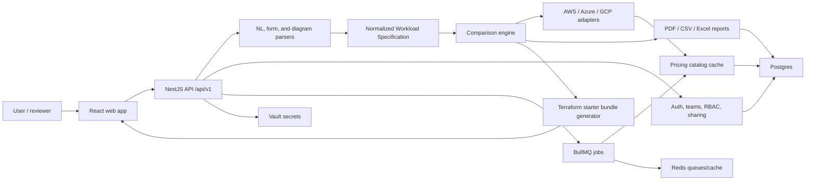

# PolyCost Architecture

PolyCost is a monorepo with a React/Vite web app, NestJS/Fastify API, Postgres,
Redis/BullMQ jobs, and Vault-backed secret access. The central design principle is
that every input path becomes the same Normalized Workload Specification, then the
same comparison/report/Terraform pipeline consumes it.

## Major Packages

| Path                  | Responsibility                                                     |
| --------------------- | ------------------------------------------------------------------ |
| `apps/web`            | React UI, comparison workspace, exports, diagrams, Terraform panel |
| `apps/api`            | API controllers, pricing adapters, comparison, reports, auth, jobs |
| `packages/types`      | shared workload, comparison, report, and time-standard definitions |
| `database/migrations` | additive schema history                                            |
| `fixtures/diagrams`   | parser safety and service-classification fixtures                  |
| `scripts`             | release gates, demo boot, live verification, evidence checks       |
| `docs/architecture`   | phase-specific architecture notes                                  |
| `docs/verification`   | phase evidence ledgers                                             |

## Runtime Flow

1. The user enters natural language, structured fields, or diagram source.
2. The API validates and normalizes input into NWS.
3. The comparison engine maps NWS services to provider-equivalent categories.
4. Provider adapters read cached catalog rows or deterministic modeled rates.
5. Results include provider totals, service line items, warnings, and trace
   evidence.
6. Reports and share links persist the comparison snapshot.
7. Terraform generation optionally turns the NWS into a reviewable provider bundle.

## Data And Evidence Flow

Pricing evidence is intentionally first-class:

- raw catalog rows are normalized into provider SKU/rate tables
- transform version, source endpoint, source record ID/key, fetched timestamp, and
  payload hash are retained where available
- comparison evidence rows connect screen totals back to source data
- refresh-live recomputes saved workloads from refreshed source rows where the
  adapter can trace them
- provider billing exports from AWS CUR, Azure Cost Management CSV, and GCP Billing
  Export JSON can be normalized into estimate-vs-actual reconciliation evidence
- imported actuals classify usage separately from taxes, credits, discounts,
  support, marketplace/private-offer charges, refunds, fees, and unknown adjustments
  so reconciliation can report usage-comparable variance without burying invoice
  adjustments inside the same number
- provider commitment rows such as Savings Plans, reservations, committed-use
  discounts, sustained-use discounts, commitment fees, and unused/amortized
  commitment costs are classified separately from generic invoice adjustments
- commitment evidence requirements are reported separately, including whether rows
  still need provider commitment inventory, amortization-period proof, or allocation
  evidence before invoice-grade use
- invoice artifacts can be registered and marked verified/rejected with review
  evidence, checksum/control-total controls, and readiness updates limited to the
  covered evidence check
- invoice artifact files can be stored in the application database with raw-byte
  SHA-256, size/MIME/file-name validation, metadata-only reconciliation evidence,
  and transaction-coupled audit events
- stored invoice artifact metadata includes the current storage backend,
  KMS-readiness flag, retention/legal-hold policy, and deterministic scan-hook status
- artifact storage readiness is exposed through an admin endpoint and strict
  provider-credential checks; staging/production config validation now requires an
  external object-store target, KMS reference, webhook scanner, and delete-expired
  retention mode before startup is accepted
- external invoice artifact bytes can be written to and read from provider-native
  AWS S3, Azure Blob Storage, or GCP Cloud Storage adapters; database records keep
  the object pointer, checksum, size, governance metadata, and audit evidence
- retention enforcement can report or delete expired non-legal-held artifact blobs
  through an explicit admin operation; external S3/Blob/GCS objects are purged before
  their database pointers are deleted
- invoice-grade readiness is represented as a matrix of evidence checks, blockers,
  and required provider artifacts rather than a yes/no claim
- exports carry methodology and data-freshness context

This supports decision-grade traceability. It is not yet invoice-grade billing.

## API Surface

The main public API lives under `/api/v1`.

Core groups:

- comparisons and evidence
- pricing coverage/status/breakdown
- workload parse/validate
- diagram parse/review
- reports and exports
- budgets, alerts, exchange rates
- share links
- regions and official calculator links
- auth, teams, invites, invite resend, sessions, mock SSO readiness
- active workspace switching for existing team memberships
- Terraform generation

Health and operations:

- `/health/live`
- `/health/ready`
- `/health`
- `/health/deep`
- `/api/v1/data-health`

## Security Boundaries

- Secrets are read through Vault-backed services.
- Production/staging config rejects `CHANGE_ME_DEV_ONLY`, `dummy`, and `example`
  placeholder values.
- Production/staging invite delivery must use a signed HTTPS webhook; local panel
  token exposure is development/demo-only.
- Anonymous comparison remains available, while team administration, billing import,
  SSO configuration, and protected account operations require sessions and RBAC.
- Diagram input has size, entity, decompression, spoofed-file, and temp-file safety
  controls.
- Rate limits cover auth, parsing, diagram import, comparison, exports, public
  reads/writes, share links, and live refresh.

## Extending A Provider Adapter

1. Add or extend an adapter in `apps/api/src/adapters`.
2. Normalize provider catalog rows into the pricing catalog schema.
3. Preserve source endpoint, source record ID/key, payload hash, transform version,
   region, SKU, currency, unit, and effective date.
4. Add fixtures and reconciliation tests.
5. Update provider credential docs and coverage guards.
6. Verify with pricing coverage, refresh-live traceability, reports, and UI evidence.

## Adding A Service Category

1. Add the service family to the shared NWS/types layer.
2. Add UI catalog metadata and workload controls.
3. Map AWS/Azure/GCP equivalent services.
4. Add catalog or modeled pricing logic for each provider.
5. Add line-item evidence and report output.
6. Add coverage tests so a frontend-priced family cannot drift without backend
   support.

## Extending Diagram Parsing

1. Add fixtures under `fixtures/diagrams`.
2. Extend parser classification aliases or structured parser logic.
3. Keep unresolved nodes reviewable instead of guessing silently.
4. Add malicious/oversized/spoofed input tests for the new format.
5. Preserve parse evidence in reports and UI.

## Extending Terraform Generation

1. Update the NWS-to-resource mapping in the Terraform generation service.
2. Keep generated providers pinned.
3. Preserve secure defaults: private database networking, runtime identity,
   cost-allocation tags/labels, and reviewable variables.
4. Add or update module files for AWS, Azure, and GCP.
5. Extend static validation checks, bundle manifest evidence, and API/web tests.
6. Keep `terraform plan` execution outside request handling until a dedicated
   sandboxed runner is designed.

## Known Architecture Boundaries

- Full invoice-grade pricing, provider invoice-of-record reconciliation, reviewer
  workflow UX, and invoice-of-record validation remain future work. The current
  hardening layer proves provider-native artifact write/read/delete adapters,
  configuration readiness, webhook scanner integration, and retention enforcement
  over database-backed and external object-backed artifact rows.
- VSDX parsing is layout-aware extraction, not full Visio rendering.
- Production LLM quality depends on a real endpoint/model, Vault secret, and corpus
  evaluation.
- Enterprise auth/team product depth still needs production email, SSO/SAML,
  SCIM, account recovery, org billing UX, and broader account administration polish.
- Terraform output is a starter bundle, not a full landing-zone module system.
