# 🗺️ PolyCost Architecture Diagrams

> Every diagram is authored in **Mermaid**, so it renders natively on GitHub and
> stays reviewable in a pull request — no binary image files to drift out of date.

| Jump to                                   |                                     |
| ----------------------------------------- | ----------------------------------- |
| [🏛️ System design](#-system-design)       | [🧱 Tiers](#-tiers-architecture)    |
| [🚢 Deployment](#-deployment)             | [🔄 Request flows](#-request-flows) |
| [🔑 Credentials flow](#-credentials-flow) | [🏭 Pipelines](#-pipelines)         |
| [🚦 State machines](#-state-machines)     | [🗄️ Data model](#-data-model-core)  |

---

## 🏛️ System design

The whole system in one view: how a workload description becomes a priced,
auditable three-cloud comparison.

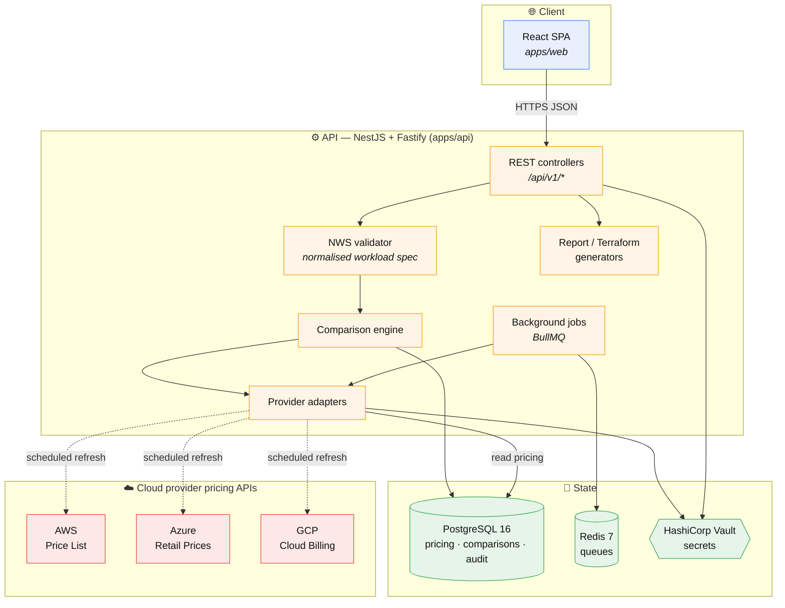

**The key idea:** provider APIs are _never_ called on the request path. A
scheduled ETL refreshes a local pricing catalog; comparisons read only from that
catalog. That keeps responses fast and deterministic, and means an outage at a
provider cannot take down pricing.

---

## 🧱 Tiers architecture

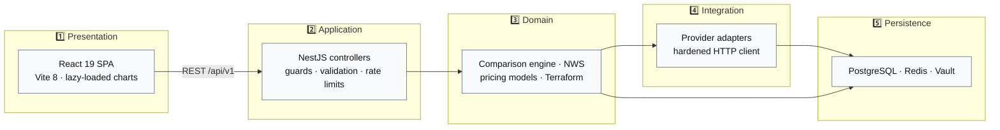

| Tier            | Responsibility                             | Must not                        |
| --------------- | ------------------------------------------ | ------------------------------- |
| 1️⃣ Presentation | Render, capture input, format money        | Contain pricing logic           |
| 2️⃣ Application  | AuthN/Z, validation, transport             | Contain provider specifics      |
| 3️⃣ Domain       | Pricing math, comparison, normalisation    | Know about HTTP or SQL dialects |
| 4️⃣ Integration  | Talk to provider APIs, normalise responses | Persist directly                |
| 5️⃣ Persistence  | Durable state, queues, secrets             | Contain business rules          |

---

## 🚢 Deployment

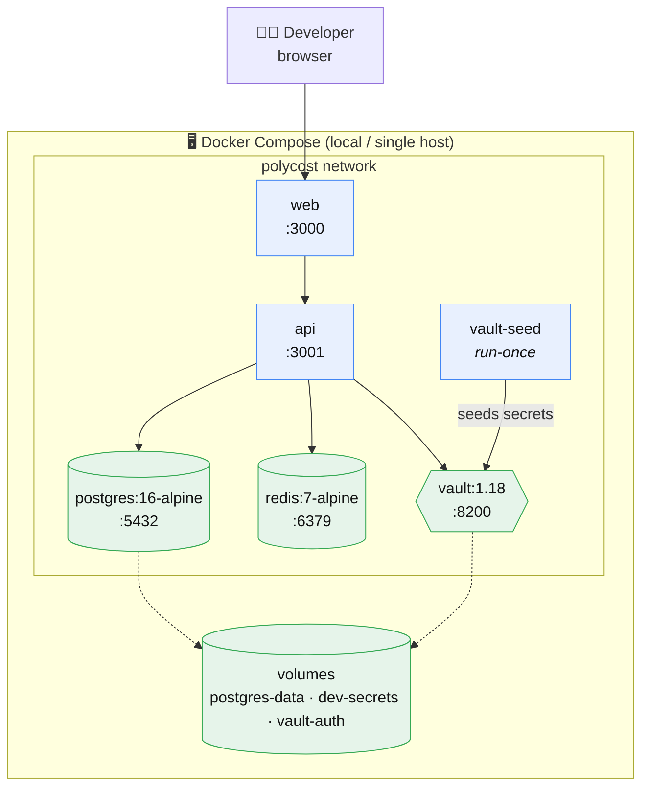

Bring the stack up and apply migrations:

```bash
docker compose up -d
npm run db:migrate
```

> ℹ️ Ports are remappable via environment variables — see [DEPLOY.md](../DEPLOY.md).
> `vault-seed` is a run-once container that provisions local development secrets;
> it exits after seeding.

---

## 🔄 Request flows

### A. Create a comparison (the primary path)

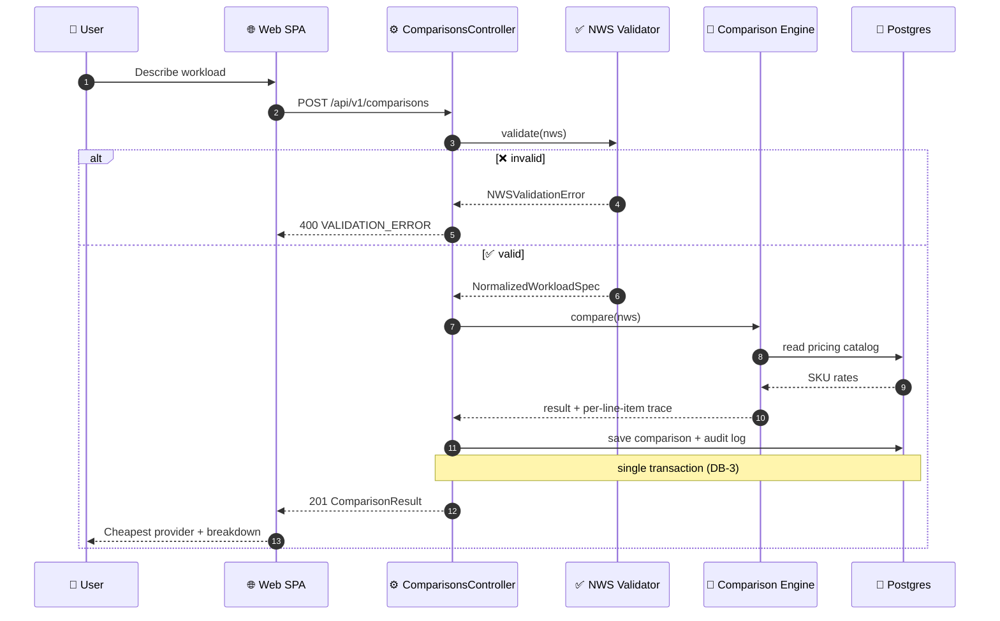

### B. Export an evidence packet (a mutation, deliberately `POST`)

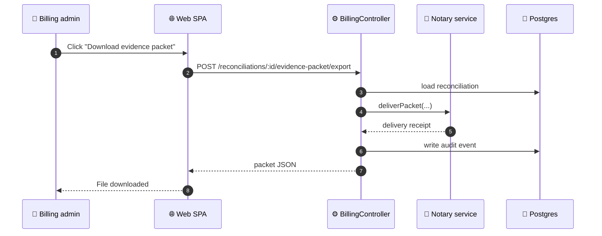

> ⚠️ This was a `GET` until it was corrected. A `GET` that notarises and writes an
> audit event fires those side effects on every prefetch, cache revalidation and
> retry. Safe methods must stay safe.

---

## 🔑 Credentials flow

No provider secret is ever stored in the database or shipped to the browser.

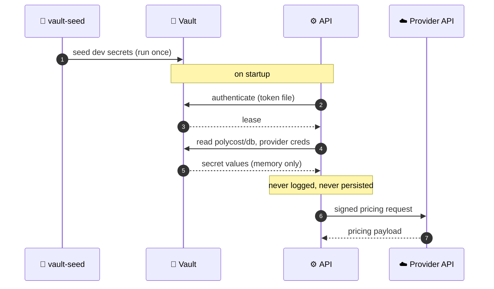

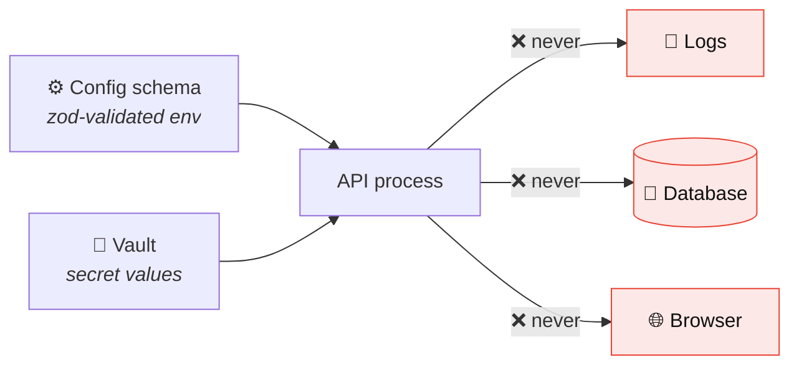

**Separation of duties:** non-secret configuration comes from a zod-validated env
schema; secret _values_ come only from Vault. See
[Provider Credentials](PROVIDER-CREDENTIALS.md) and
[Config & Secrets](../09-CONFIG-AND-SECRETS.md).

---

## 🏭 Pipelines

### Pricing ETL (scheduled)

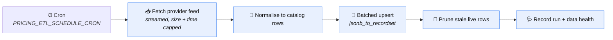

Resilience properties built into this pipeline:

- 📏 **Size cap enforced while streaming** — a chunked response with no
  `Content-Length` cannot silently buffer past the limit.
- ⏱️ **Wall-clock deadline covers the body**, not just the headers.
- 🔁 **Bounded pagination** — hard page ceilings prevent an infinite loop.
- 🛡️ **Same-origin pagination guard** — a `NextPageLink` pointing off the pinned
  host is refused (SSRF).
- 📦 **Batched upserts** with a per-row fallback, so one malformed row rejects
  only itself.

### CI pipeline

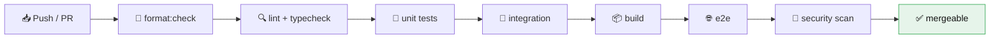

### Local git hooks

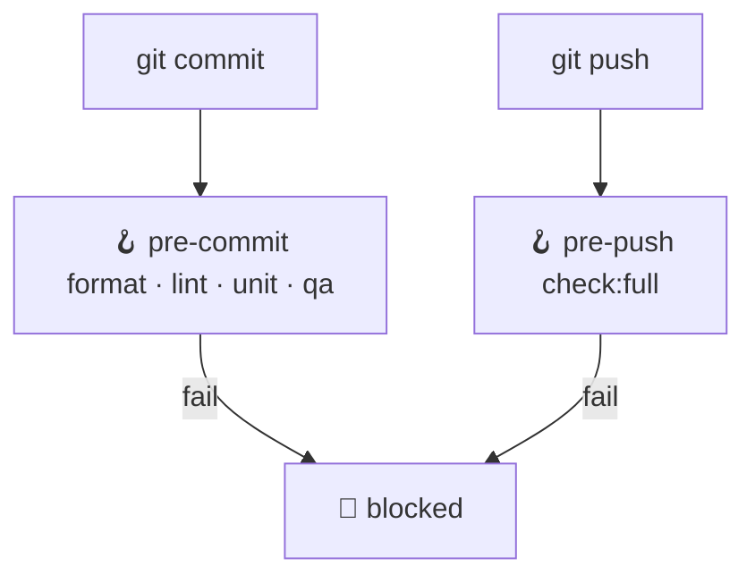

Activate with `npm run hooks:install`.

> ⚠️ `pre-push` runs the **full** verification suite (integration + e2e +
> security), which needs Docker services running. See
> [Known Issues](KNOWN-ISSUES.md) for the practical caveat.

---

## 🚦 State machines

PolyCost has **no order/checkout domain**. The equivalent lifecycle machines are
listed below — all values are taken directly from database `CHECK` constraints,
so these diagrams match what the schema actually enforces.

### 📥 Billing import run

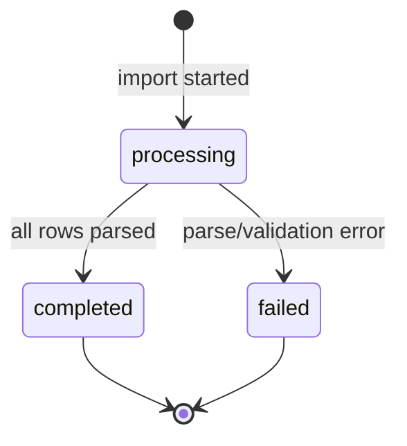

### ⚖️ Invoice reconciliation outcome

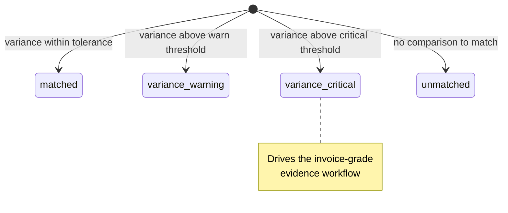

> ℹ️ Mermaid state IDs cannot contain hyphens. The stored values are
> `matched`, `variance-warning`, `variance-critical`, `unmatched`.

### 📮 Audit export outbox

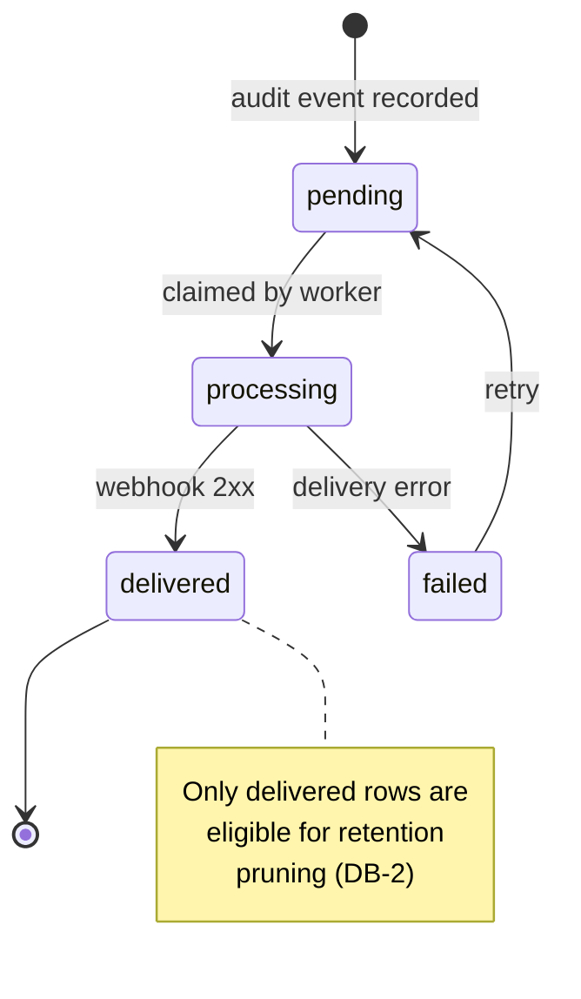

> 🔒 **Safety invariant:** `team_audit_event_exports` cascades from
> `team_audit_events`. Retention therefore refuses to prune an audit event that
> still has a `pending`/`processing`/`failed` export — otherwise deleting the
> event would silently destroy an undelivered compliance export.

### 📊 Report export job & prewarm job

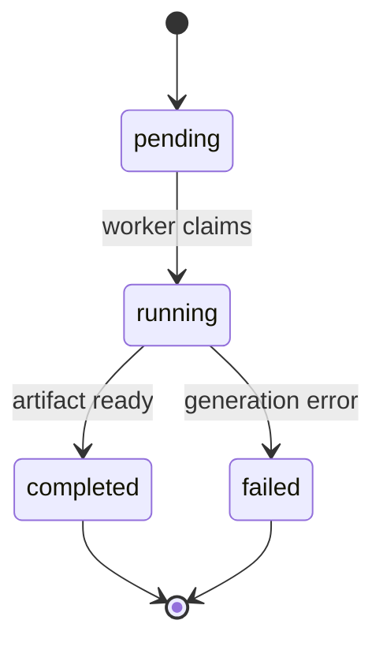

### ✉️ Team invitation

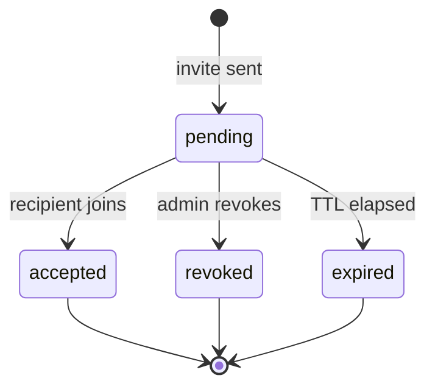

### 👤 Account · 🔄 sync · 🧾 artifact

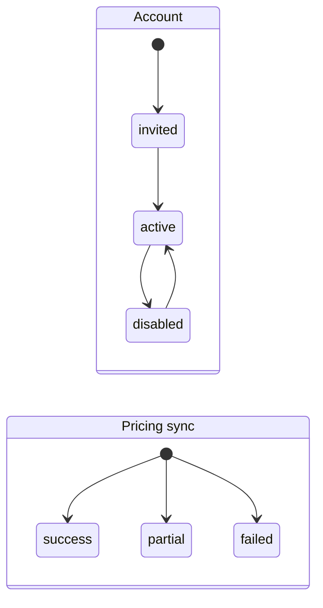

Invoice artifacts additionally carry `malware_scan_status`
(`passed`/`failed`) and an optional `provider_retention_proof_status`
(`declared`/`provider-verified`).

---

## 🗄️ Data model (core)

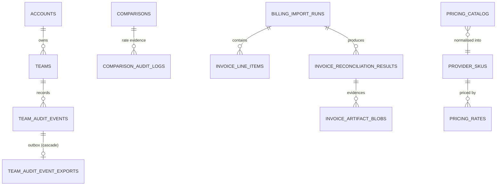

Full schema: [Data Model](../04-DATA-MODEL.md).

---

<sub>🗺️ All diagrams reflect the schema and code as of the current `main`.
Status values are sourced from live database `CHECK` constraints.</sub>
