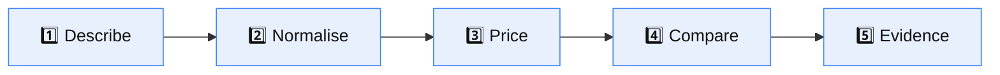
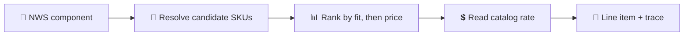

# ⚙️ How PolyCost Works

> **One sentence:** you describe a workload once, and PolyCost prices that same
> workload against AWS, Azure and GCP from a locally-cached provider pricing
> catalog — showing the cheapest option plus a line-by-line trail of how every
> number was derived.

| Jump to                                                 |                                                                       |
| ------------------------------------------------------- | --------------------------------------------------------------------- |
| [🧩 The core problem](#-the-core-problem)               | [🔁 The five stages](#-the-five-stages)                               |
| [🧮 Pricing math](#-how-a-price-is-actually-calculated) | [🩺 Trusting the numbers](#-how-you-know-the-numbers-are-trustworthy) |
| [🔐 Secrets](#-how-secrets-are-handled)                 | [🚀 Deploying](#-how-to-deploy)                                       |

---

## 🧩 The core problem

Comparing cloud costs by hand is unreliable because each provider models the
same workload differently:

|                | AWS                  | Azure                        | GCP                         |
| -------------- | -------------------- | ---------------------------- | --------------------------- |
| Compute unit   | Instance type        | VM size                      | Machine type                |
| Pricing feed   | Bulk Price List JSON | Retail Prices API            | Cloud Billing Catalog       |
| Discount model | Savings Plans / RIs  | Reservations                 | **Automatic** sustained-use |
| Unit quirk     | per-hour             | often **per-N-hours** blocks | per-hour                    |

Two of those differences silently corrupt naive comparisons: Azure quotes some
meters in blocks (`"10 Hours"`), and GCP applies sustained-use discounts you
never explicitly buy. PolyCost normalises both.

---

## 🔁 The five stages



### 1️⃣ Describe

Input a workload as a **form**, **natural language**, a **diagram** (Draw.io /
VSDX), or **Terraform**. Each route converges on the same internal shape.

### 2️⃣ Normalise → the NWS

Everything becomes a **Normalized Workload Specification (NWS)** — a
zod-validated, versioned document describing compute, storage, database,
network and availability requirements in provider-neutral terms.

```jsonc
{
  "schemaVersion": "1.0",
  "workload": { "type": "web_app", "region": { "preference": "us-east-1" } },
  "compute": [{ "role": "api", "vcpu": 4, "memoryGb": 16, "scalingType": "fixed" }],
  "storage": [{ "role": "uploads", "type": "object", "sizeGb": 500 }],
  "database": [{ "role": "primary", "engine": "postgres", "highAvailability": true }],
}
```

> 🛡️ Arrays are capped (250 components). Without a cap, one request could expand
> into millions of per-component × 3-provider iterations — a DoS amplifier.

### 3️⃣ Price

Each provider adapter resolves NWS components to concrete SKUs and reads rates
from the **local pricing catalog** — never from a live provider call on the
request path.



The engine picks the **cheapest SKU that still satisfies the requirement** — so
a burstable or ARM instance can legitimately win.

### 4️⃣ Compare

Line items roll up per provider across daily → yearly intervals, with pricing
models (on-demand, reserved, savings plans, GCP sustained-use) applied per
provider's real rules.

### 5️⃣ Evidence

Every line item carries a **pricing trace**: source endpoint, source record ID,
SKU, unit, unit price, effective date, fetch time, payload hash, and the
derivation expression (e.g. `0.096 hourly USD × 730 monthly hours`).

That trace is what makes a number defensible in a FinOps review, and it feeds
the invoice reconciliation workflow.

---

## 🧮 How a price is actually calculated

Worked example — 1 × 4 vCPU / 16 GB Linux VM, us-east-1, on-demand:

| Step                   | Value                        |
| ---------------------- | ---------------------------- |
| Resolved SKU           | `m7i.large`-class compute    |
| Catalog unit price     | `$0.096` / hour              |
| Monthly hours constant | `730`                        |
| **Monthly cost**       | `0.096 × 730 =` **`$70.08`** |

Three normalisations that materially change results:

- 🇪🇺 **Azure block meters.** A meter priced `"10 Hours"` is divided to a true
  per-unit rate. Missing this inflates Azure by up to 10×.
- 🟢 **GCP sustained-use discount.** Applied automatically by family, because GCP
  applies it whether or not you ask.
- 🚫 **Spot / low-priority exclusion.** These are `Consumption`-type meters but
  are _not_ standard on-demand rates; including them made Azure look 10–90% too
  cheap.

---

## 🩺 How you know the numbers are trustworthy

| Guarantee                            | Mechanism                                                                          |
| ------------------------------------ | ---------------------------------------------------------------------------------- |
| 🏷️ Never mistake demo data for real  | `dataProvenance` = `live` / `mock` / `seeded` / `mixed`, plus `usesNonLivePricing` |
| ⏰ Never trust stale prices silently | Freshness policy + per-provider age and alerts                                     |
| 🔍 Every number is explainable       | Per-line-item pricing trace with source + derivation                               |
| 💵 Currency is never assumed         | Non-USD provider exports are **rejected**, not summed as USD                       |
| 🔢 Money parses correctly            | `"1,234.56"` parses as `1234.56`, not `1`                                          |
| 🧾 Compliance trail is complete      | Audit event + delivery outbox commit atomically                                    |

---

## 🔐 How secrets are handled

Non-secret config comes from a **zod-validated environment schema**; secret
_values_ come only from **Vault**, are held in memory, and are never logged,
persisted, or sent to the browser. See [Diagrams → Credentials flow](DIAGRAMS.md#-credentials-flow).

---

## 🚀 How to deploy

### Local (Docker Compose)

```bash
git clone https://github.com/adeelarshad414/polycost.git
cd polycost
npm install
docker compose up -d
npm run db:migrate
```

Then open **http://localhost:3000** (API on **:3001**).

| Command                | Purpose                                |
| ---------------------- | -------------------------------------- |
| `docker compose up -d` | Start postgres, redis, vault, api, web |
| `npm run db:migrate`   | Apply migrations (atomic, re-runnable) |
| `npm run db:validate`  | Verify schema matches expectations     |
| `docker compose down`  | Stop the stack                         |
| `npm run db:reset`     | ⚠️ Destroy volumes and recreate        |

### Enabling live pricing

Live pricing is **off** by default — the stack ships with seed/mock data so it
runs with no cloud account. To enable it, provision provider credentials into
Vault and turn on live mode:
[Live Pricing Credentials](operations/live-pricing-credentials.md) ·
[Provider Credentials](PROVIDER-CREDENTIALS.md).

### Production

Production deployment, migration strategy, and rollback are covered in
[DEPLOY.md](../DEPLOY.md), [docs/DEPLOYMENT.md](DEPLOYMENT.md) and the
[Runbook](RUNBOOK.md).

> ⚠️ Two operational flags default to **safe/off** and require an explicit,
> irreversible opt-in:
> `DATA_RETENTION_ENFORCEMENT_MODE` (deletes expired rows) and
> `INVOICE_ARTIFACT_RETENTION_ENFORCEMENT_MODE` (deletes invoice artifacts).

---

## 🔗 Where to go next

[🗺️ Diagrams](DIAGRAMS.md) · [📋 Requirements](REQUIREMENTS.md) ·
[📖 Glossary](GLOSSARY.md) · [🧭 Learning Path](LEARNING-PATH.md) ·
[🐞 Known Issues](KNOWN-ISSUES.md)
