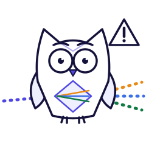

# Design System Handover: PolyCost Aurora

This is the single reference for how PolyCost looks and behaves. The tokens themselves live in
`apps/web/src/styles/tokens.css`. `BRAND.md` covers brand usage, and the export palette in
`apps/api/src/reports/report-brand.ts` mirrors the same values.

## Brand

- Product: PolyCost. Tagline: "Multi-cloud cost clarity, in one place."
- Logo: three ascending bars in the provider fills plus the wordmark, in `apps/web/public/brand/`.
- One brand accent: Aurora indigo `#4F46E5` (dark `#818CF8`). The terracotta alternate was
  removed in UI-0.
- Gradients belong to the frame and never to the data. They are used on the hero mesh, the
  primary call to action, the 2px brand hairline and KPI tile backgrounds. Inside charts, colour
  only encodes data.
- The social preview is a 1200×630 PNG from `scripts/generate-og-image.mjs`.

## Tokens

All raw values live in `tokens.css`. `npm run theme:hex:check` rejects hex and `rgb()`/`hsl()`
anywhere else, and stylelint (part of `npm run lint`) rejects literal colours, font sizes,
weights and radii.

| Group      | Tokens                                                                                                                            | Notes                                                     |
| ---------- | --------------------------------------------------------------------------------------------------------------------------------- | --------------------------------------------------------- |
| Theme      | Light, Dark, System (default)                                                                                                     | Dark is declared for the OS preference and for the toggle |
| Surfaces   | `--bg-canvas`, `--bg-surface`, `--bg-raised`, `--bg-sunken`, `--border-*`                                                         | Cool ink neutrals                                         |
| Text       | `--text-primary`, `--text-secondary`, `--text-muted`                                                                              | Each ≥ 4.5:1 on every surface (`tokens-contrast.spec`)    |
| Brand      | `--brand-primary`, `-hover`, `-active`, `-soft`, `--brand-violet/magenta/cyan`                                                    | Magenta and cyan are decorative only                      |
| Status     | `--success`, `--warning`, `--danger`, `--info`, `--estimate`, each with `-soft`                                                   | Always paired with an icon or a label                     |
| Providers  | `--provider-aws/azure/gcp` (fills), `-ink` (text), `-tint`, `-soft`                                                               | Identity only; CVD-validated, not the vendor hex          |
| Mascot     | `--iris-ink/-body/-tint/-accent`, `--iris-beam-aws/-azure/-gcp` (→ provider fills), `--iris-spark-1..3` (→ violet/magenta/cyan)   | Iris only; see below                                      |
| Categories | `--cat-compute … --cat-operations`                                                                                                | Fixed order; never a provider hue                         |
| Data ramps | `--seq-1…10` (+ `--seq-ink-strong` from step 6), `--div-under-1…3`, `--div-mid`, `--div-over-1…3`                                 | Magnitude and variance                                    |
| Gradients  | `--grad-cta`, `--grad-cta-hover`, `--grad-brand-line`, `--grad-hero-mesh`, `--grad-kpi-*`, `--grad-glass`, `--grad-skeleton`      | Text only on `--grad-cta`                                 |
| Type       | `--font-display` (Sora), `--font-body` (Inter), `--font-mono` (JetBrains Mono); `--fs-12…56`; `--fw-regular/medium/semibold/bold` | Self-hosted fonts                                         |
| Shape      | `--radius-xs/sm/control/card/hero/pill`; `--shadow-sm/md/lg/glow-brand/focus`                                                     |                                                           |
| Motion     | `--ease-standard`, `--ease-emphasized` (expo-out), `--dur-fast/base/slow`                                                         | A global reduced-motion reset applies                     |

## Shared UI Components

| Component                                                                                                                                                     | Usage rule                                                                                       |
| ------------------------------------------------------------------------------------------------------------------------------------------------------------- | ------------------------------------------------------------------------------------------------ |
| `Button`                                                                                                                                                      | One primary per surface. Primary uses `--grad-cta`; destructive fill only inside `ConfirmDialog` |
| `components/ui`: `Card`, `KpiTile`, `Badge`, `ProvenancePill`, `Skeleton`, `EmptyState`                                                                       | Token-only building blocks; an empty state has one sentence and at most one action               |
| `OverlayPrimitives`                                                                                                                                           | Dialog, `ConfirmDialog`, drawer, popover, toast, banner. Destructive flows use `ConfirmDialog`   |
| `ResultTabs`                                                                                                                                                  | Roving-focus tablist; optional controlled mode for URL sync                                      |
| `charts/`: `ProviderComparisonBar`, `CostByServiceStacked`, `TrendForecastArea`, `CommitmentBreakEven`, `RegionProviderHeatmap`, `VarianceChart`, `Sparkline` | Built on `ChartFrame`: title, units, legend for 2+ series, "View as table"                       |
| `results/VerdictHero`, `VerdictKpis`, `ComparisonAnnouncer`                                                                                                   | Answer first: verdict, gaps, provenance, key figures, live announcement                          |
| `features/landing/LandingHero`                                                                                                                                | Promise, two calls to action, live proof points, labelled sample result                          |
| `features/workspace/WorkspaceOverview`                                                                                                                        | Signed-in landing: team, invites, invoice variance, activity                                     |
| `ThemeSwitcher`                                                                                                                                               | Light/Dark/System segmented control                                                              |
| `brand/Iris`                                                                                                                                                  | Decorative mascot (`pose`, `size`, `tile`). Never in charts, tables, login or destructive UI     |
| `TopLoadingBar`, `LoadingExperience`                                                                                                                          | Page progress and boot/session/skeleton states                                                   |

## Data-visualisation grammar

1. A provider colour means that provider and nothing else: no categories, gradients, rails or
   decoration.
2. Provider quotes are alternatives. They are compared and never summed, and there is no
   part-to-whole chart of alternatives.
3. Categories keep one order and one colour everywhere, on screen and in PDF/XLSX exports.
4. Missing data is shown as "—" with the reason. It is never a bar of zero length or a coloured
   placeholder.
5. Every value states its unit and period. Money uses tabular figures.
6. Two or more series always get a legend, and every chart has a table view, so colour is never
   the only cue.
7. Text uses text tokens, never the series colour.

These rules are enforced by tests in `apps/web/src/charts/charts.spec.tsx`.

## Illustration: Iris

Iris is the PolyCost mascot: a gem-bodied owl, the "cloud navigator". Her belly is a
diamond prism. One indigo beam goes in, and three **equal** beams come out, one per
provider. That is the product in one picture: one workload, three clouds. She is calm and
precise, she shows the evidence, and she never cheers for a vendor. The art is flat line
art (**v1**) on a 240×240 viewBox. The source files are `apps/web/public/brand/iris/`
(standalone SVGs with colour fallbacks, for the README and social posts). The app renders
`components/brand/Iris.tsx` from `iris-art.ts`, which is generated from those files and
contains no hex values.

| Pose                                                                             | Use                                                                                     |
| -------------------------------------------------------------------------------- | --------------------------------------------------------------------------------------- |
|  `welcome`             | Landing hero, first-run "Ready to compare"                                              |
|  `analysing`       | Comparison loading, results verdict card                                                |
|  `verdict`             | "Results ready" toasts and onboarding illustrations only; never beside a named provider |
|  `warning`             | Pricing warnings, "No provider could be priced"                                         |
|  `celebrating` | Success moments (export complete). Not yet placed: no success surface exists            |

**Rules** (each enforced where possible):

1. **The three exit beams are always equal** in length, width and opacity. No prop can
   recolour, resize or hide a beam. This is checked from the path data in `iris.spec.tsx`.
   Any new pose must keep this rule.
2. **Never inside a chart** (an ESLint `no-restricted-imports` rule covers `src/charts` and the
   legacy chart files) or a table (an e2e check). The verdict card uses `analysing` only
   (a unit test).
3. **Provider colours appear only on the beams** and the refraction lines inside the prism
   (a unit test).
4. **No provider colours for status.** The warning pose uses ink and indigo; red is reserved
   for errors, and Iris carries none.
5. **Sparks** (violet, magenta, cyan) appear on `celebrating` only (a unit test).
6. **Not in security-critical or destructive UI:** login, the share-link password form,
   `ConfirmDialog`.
7. **Decorative:** always `aria-hidden`, never focusable. The surrounding text carries the meaning.

| Prop        | Type                                                        | Default           | Notes                                                                               |
| ----------- | ----------------------------------------------------------- | ----------------- | ----------------------------------------------------------------------------------- |
| `pose`      | `welcome \| analysing \| verdict \| warning \| celebrating` | required          |                                                                                     |
| `size`      | number (px)                                                 | 120               | Clamped to ≥ 48. Use 48 (inline hint), 84 (mobile card), 120, 150 (verdict) or 240+ |
| `tile`      | boolean                                                     | follows the theme | White sticker tile; on in dark mode, off in light, decided in CSS                   |
| `className` | string                                                      |                   | Layout only; never colour                                                           |

| Placement                                                      | Pose        | Size     |
| -------------------------------------------------------------- | ----------- | -------- |
| Landing hero, beside the eyebrow                               | `welcome`   | 96       |
| First-run "Ready to compare"                                   | `welcome`   | 120      |
| Comparison loading                                             | `analysing` | 84       |
| Results verdict card (left of the verdict; above it on phones) | `analysing` | 150 / 84 |
| "No provider could be priced"                                  | `warning`   | 110      |
| Pricing warnings alert                                         | `warning`   | 84       |

The art uses presentation attributes only (no `style`), so the build-generated CSP stays
strict. Dark mode keeps the light body on a white tile rather than recolouring her.

## Content and voice

- Use plain words. Ages read as "6 hours" or "3 days", not "538.1h".
- Never show internal names to users: environment variables, "ETL", "Demo controls", "Server
  analytics". An e2e test rejects `/[A-Z_]{6,}=/` in visible text.
- Label provenance honestly: "Seed data", "Sample result", "Includes seed pricing".
- Lead with the answer ("Azure is the lowest-cost option for this workload"), then the evidence.

## Interaction Rules

- Targets are at least 40px (24×24 is the WCAG floor). Icon-only buttons need an `aria-label`,
  and a visible label is part of the accessible name (WCAG 2.5.3).
- Loading shows phase labels, not fake percentages.
- Overlays never stack modals; focus moves in, is trapped, and returns.
- Responsive layouts have no element past the viewport at 375px (e2e-enforced). Grids use
  `minmax(0, 1fr)`.
- Motion is 120 to 320ms on transform and opacity only. Nothing loops idly, and it is all skipped
  under reduced motion.
- Comparisons have URLs (`/compare/<id>`) and workspace sections live in the hash
  (`#workspace/<section>`).

## Exports

PDF and XLSX use `report-brand.ts`: the Aurora provider and category palettes, indigo table
headers, a four-band brand line on every PDF page, and a verdict sentence at the top of page one.
Report text colours are asserted at 4.5:1 or better on white.

## Guard Commands

```bash
npm run lint              # eslint + stylelint token rules
npm run theme:hex:check   # no raw colour outside tokens.css
npm run bundle:budget     # landing JS+CSS ≤ apps/web/bundle-budget.json
npm run lighthouse:ci     # a11y ≥ 95, best practices ≥ 90, performance ≥ 80
npm run test:visual --workspace @polycost/web   # screenshot regression (Playwright image)
npm run loading:check
npm run overlay:check
npm run handover:check
```

Accessibility status and the manual screen-reader checklist live in
`docs/accessibility/2026-q4.md`.
